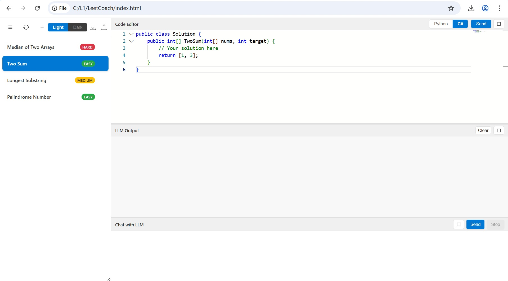

# LeetCoach (WIP)

A personal coding preparation note keeping platform to practice Leetcode.

## Features of UI

- Basic code editor
- Code execution simulation with LLM
- Past problems saved
- Generate problems on the fly

## Screenshot

## Getting Started

N/A

## Contributing

N/A

## License

N/A