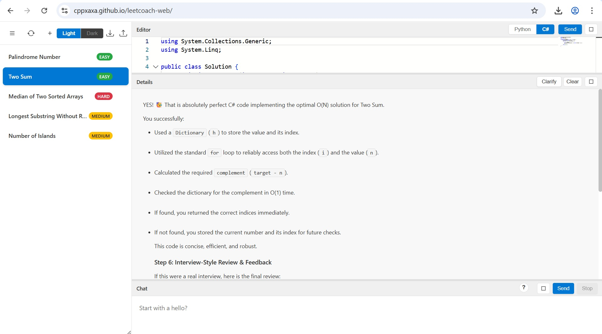

# Leet Coach web

A personal coding preparation note keeping platform to practice Leetcode.

## Live app link
https://cppxaxa.github.io/leetcoach-web/

It is possible because it is completely client side application.

## Features

- Basic code editor
- Code execution simulation with LLM
- Past problems saved
- Generate problems on the fly

## Screenshot

#### Web App

#### Dry Run

## Getting Started

1. Clone the repo
2. Open VSCode or any editor of your choice
3. Launch the index.html to see the app

## Contributing

1. Make modifications
2. Have minimal code changes
3. Easy for LLM to later modify it
4. Mark the files that LLM should not touch with a comment in the file
5. Feature should be complete and have nearly no bugs and heavily tested
6. Raise a PR

## License

Consider MIT License or Apache 2.0 License

It is a vibe coded application. Feel free to reuse without limitations.
